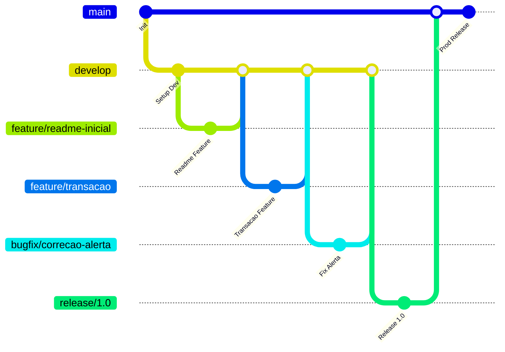

# Git Workflow - SAFeR

Guia completo de fluxo de branches, padrões de commits e comandos Git para o projeto **SAFeR**, seguindo boas práticas de desenvolvimento.

---

## 1. Estrutura de Branches

| Branch           | Descrição |
|-----------------|-----------|
| `main`           | Branch estável, pronta para produção |
| `release/x.x`    | Prepara a versão final antes de enviar para `main` |
| `develop`        | Branch de desenvolvimento contínuo, integra features antes do release |
| `feature/nome`   | Novas funcionalidades desenvolvidas isoladamente e depois integradas (merge) em `develop` |
| `bugfix/nome`    | Correções rápidas de bugs |

**Legenda:**
- merge → Integração de branches  
- feature → Novas funcionalidades  
- bugfix → Correção de bugs  
- main → Branch principal / produção  
- develop → Branch de desenvolvimento

---

## 2. Diagrama do Fluxo de Branches

🔹 Comandos Básicos

3.1 Comandos Básicos

 
Clique para expandir

         

### Clonar repositório remoto
git clone url-do-repositorio-no-github

### Inicializar repositório local
git init
git add .
git commit -m "Commit inicial"

### Renomear branch principal para main
git branch -M main

### Conectar repositório remoto
git remote add origin url

### Enviar commits para o repositório remoto
git push -u origin main

3.2 Fluxo de Criação de Branches

 
Clique para expandir

### Criar branch de desenvolvimento
git checkout -b develop

### Criar branch de release
git checkout -b release/1.0 develop

### Criar branches de feature
git checkout develop
git checkout -b feature/readme-inicial
git checkout -b feature/transacao
git checkout -b feature/alerta-fraude

### Criar branch de bugfix
git checkout develop
git checkout -b bugfix/correcao-alerta

### Entrar em uma branch existente
git checkout nome-da-branch

### Voltar para main ou develop
git checkout main
git checkout develop

### Merge de feature para develop
git checkout develop
git merge feature/readme-inicial

### Merge de release para main
git checkout main
git merge release/1.0

### Deletar branch local
git branch -d feature/readme-inicial
git branch -d release/1.0

### Push para GitHub
git push -u origin main
git push -u origin develop
git push -u origin feature/readme-inicial
git push -u origin release/1.0

3.3 Comandos Avançados

 
Clique para expandir

         
### Buscar alterações do remoto sem mesclar
git fetch

### Atualizar branch local com remoto
git pull origin main

### Forçar envio de alterações (mais seguro)
git push --force-with-lease

### Reverter commit específico
git revert id_do_commit

### Resetar para commit anterior (cuidado!)
git reset --hard id_do_commit

### Alterar a mensagem do último commit
git commit --amend -m "nova mensagem"

### Aplicar commit específico de outra branch
git cherry-pick HASH_DO_COMMIT

### Alternar ou criar branch
git switch nome-da-branch
git switch -c nova-branch

## 📌 Padrões de Commits - SAFeR

Tabela de referência para padronizar commits no projeto **SAFeR**:

| Tipo do Commit                 | Palavra-chave | Descrição |
|--------------------------------|---------------|-----------|
| Acessibilidade                 | accessibility | Melhorias de acessibilidade |
| Adicionando um teste           | test          | Adiciona testes unitários ou de integração |
| Atualizando submódulo          | upgrade       | Atualiza a versão de um submódulo |
| Retrocedendo submódulo         | downgrade     | Reverte a versão de um submódulo |
| Adicionando dependência        | build         | Adiciona nova dependência |
| Removendo dependência          | build         | Remove dependência |
| Alterações de revisão de código| style         | Ajustes de estilo ou formatação |
| Animações e transições         | animation     | Implementa ou ajusta animações e transições |
| Bugfix                         | fix           | Corrige bugs no código |
| Comentários                    | docs          | Adiciona ou altera comentários |
| Commit inicial                 | init          | Commit inicial do projeto |
| Configuração                   | chore         | Alterações de configuração ou scripts |
| Deploy                         | deploy        | Publicação ou deploy do projeto |
| Documentação                   | docs          | Alterações em documentação |
| Em progresso                   | wip           | Commit em andamento (Work In Progress) |
| Estilização de interface       | feat          | Mudanças visuais e estilização |
| Infraestrutura                 | ci            | Alterações na infraestrutura, CI/CD |
| Lista de ideias (tasks)        | task          | Criação de lista de tarefas ou ideias |
| Mover/Renomear                 | chore         | Move ou renomeia arquivos |
| Novo recurso                    | feat          | Implementa nova funcionalidade |
| Package.json em JS             | build         | Alterações em package.json ou dependências JS |
| Performance                    | perf          | Melhorias de performance |
| Refatoração                    | refactor      | Refatora código sem alterar funcionalidades |
| Limpeza de código              | cleanup       | Remove código desnecessário ou comentado |
| Removendo arquivo              | remove        | Remove arquivo(s) do projeto |
| Responsividade                 | responsive    | Ajustes de responsividade |
| Revertendo mudanças            | fix           | Reverte commits anteriores |
| Segurança                      | security      | Correções ou melhorias de segurança |
| SEO                            | seo           | Alterações voltadas para SEO |
| Tag de versão                  | version       | Criação de tag de versão |
| Teste de aprovação             | test          | Commit de teste aprovado |
| Testes                         | test          | Adiciona testes unitários ou funcionais |
| Texto                          | text          | Alterações em textos ou conteúdos |
| Tipagem                        | types         | Alterações de tipagem (TS ou Flow) |
| Tratamento de erros            | error         | Implementa ou ajusta tratamento de erros |
| Dados                          | raw           | Alterações ou inclusão de dados |

---

## Comandos Git

### 1. Iniciar repositório ##
git init 

git add .

git commit -m "Commit inicial"

### 2. Criar branch de desenvolvimento ##
git checkout -b develop

### 3. Criar branch de release ## 
git checkout -b release/1.0 develop

### 4. Criar branches de feature ##
git checkout develop

git checkout -b feature/readme-inicial

git checkout -b feature/transacao

git checkout -b feature/alerta-fraude

### 5. Criar branch de bugfix ##
git checkout develop

git checkout -b bugfix/correcao-alerta

### 6. Entrar em uma branch existente ##
git checkout nome-da-branch
### exemplo: git checkout feature/readme-inicial

### 7. Voltar para main ou develop ##
git checkout main

git checkout develop

### 8. Merge de feature ou release ##
#### Merge feature para develop
git checkout develop

git merge feature/readme-inicial
#### Merge release para main

git checkout main

git merge release/1.0

### 9. Deletar branch local
git branch -d feature/readme-inicial

git branch -d release/1.0

 
### 10. Push para GitHub
git push -u origin main

git push -u origin develop

git push -u origin feature/readme-inicial

git push -u origin release/1.0
#### Para branches futuras

git push -u origin nome-da-branch

 
### Dicas rápidas
#### - Trabalhe em branches de feature e só faça merge quando testado.
#### - Teste a release antes de mesclar na main.
#### - Use nomes claros nas branches.
#### - Use nomes claros e delete branches antigas para manter o repositório limpo.

